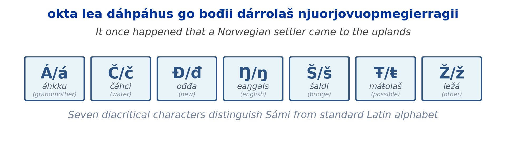

# North Sámi OCR + Translation

Lightweight CNN-CTC OCR for North Sámi (`sme`), with optional English
translation via [TartuNLP](https://api.tartunlp.ai/translation/v2)
([source](https://github.com/TartuNLP/translation-api)).

Bachelor thesis project at the University of Southern Denmark - Musioł (student), Varde, Heredia (supervisors), in SDU's report-plus-article format. The scientific
article was accepted at **IISA 2026** as *"Lightweight OCR in North Sámi
Heritage Digitization for Smart Learning"*, an extended abstract of the
same work was accepted to the **SCAI 2026** poster track.

- Summary report: [`thesis_report/`](./thesis_report/)
- IISA paper sources: [`iisa_paper/`](./iisa_paper/)
- SCAI extended abstract: [`scai_paper/`](./scai_paper/)
- SCAI poster: [`scai_poster/`](./scai_poster/)
- Pretrained checkpoint: [`magwrap/cnn-ctc-ocr-sme`](https://huggingface.co/magwrap/cnn-ctc-ocr-sme)



## Headline results

Benchmarked on 1,048 line images (1,000 in-domain Språkbanken synthetic +
48 synthetically rendered sentences from Johan Turi's 1910 *Muitalus
sámiid birra*); CPU inference on AMD Ryzen 5 PRO.

| Model                       | Char acc | Word acc |   s/img | Size   |
|-----------------------------|---------:|---------:|--------:|-------:|
| `trocr_smi_synth` (best TrOCR) | 91.45 %  | 71.84 %  |   12.41 | 350 MB |
| **`ctc_simple` (ours)**     | **87.76 %** | 62.65 % | **0.033** | **23 MB** |
| `trocr_smi_pred_synth`      | 84.15 %  | 54.24 %  |   12.08 | 350 MB |
| `trocr_smi`                 | 75.88 %  | 36.50 %  |   16.23 | 350 MB |

Our CNN-CTC trails the best TrOCR by 3.69 pp CER while being ~15× smaller
and ~380× faster (~109k img/h vs ~290 img/h). It also stays stable on
out-of-domain historical text (12.24 % → 12.21 % CER), where the best
TrOCR degrades by 4.84 pp.

## Quick Start

```bash
nix develop                                    # enter dev shell (auto-installs deps)

# Benchmark all synthetic images in test_data/account_of_sami/ (default mode)
python src/ocr_translate_pipeline.py --model trocr_smi_pred_synth

# OCR + translate a single image
python src/ocr_translate_pipeline.py --single-image \
    --image test_data/test1.jpg --model trocr_smi_pred_synth

# Interactive model picker
python src/ocr_translate_pipeline.py --list-models
python src/ocr_translate_pipeline.py --single-image --image test_data/test1.jpg
```

## Models

**TrOCR (pre-trained, no training needed):** 7 variants from
[Språkbanken](https://huggingface.co/Sprakbanken) — `trocr_smi`, `trocr_smi_nor`,
`trocr_smi_pred`, `trocr_smi_nor_pred`, `trocr_smi_synth`,
`trocr_smi_pred_synth` (best), `trocr_smi_nor_pred_synth`.

**Modular CTC (custom-trained):** pluggable `Backbone → Encoder → CTC` —
15 combinations of {SimpleCNN, VGG16, VGG19, ResNet50, ResNet101} ×
{None, BiLSTM, Transformer}, e.g. `ctc_simple`, `crnn_vgg16`,
`transformer_resnet50`.

The winning configuration from the paper is `ctc_simple`: a 7-layer CNN
backbone (64 → 128 → 256² → 512³ channels) on 32 × 800 px grayscale
inputs, adaptive-pooled and projected to 256-d, decoded with CTC over a
395-symbol vocabulary. Pretrained ImageNet backbones (VGG-16/19,
ResNet-50) failed to converge in our training runs — a negative result
documented in the paper.

Trained checkpoints live in `trained_models/<date>_queue/<arch>/checkpoint_best.pt`
and are auto-discovered by `--list-models`.

### Pretrained CTC checkpoint (HuggingFace Hub)

One lightweight CNN-CTC variant trained on `Sprakbanken/synthetic_sami_ocr_data`
is published on the Hub:

- [`magwrap/cnn-ctc-ocr-sme`](https://huggingface.co/magwrap/cnn-ctc-ocr-sme)

Fetch it into the expected layout with:

```bash
python src/ocr/download_models.py
```

## Training

```bash
python src/ocr/train_queue.py --test       # smoke test: 5 epochs, 500 samples
python src/ocr/train_queue.py --fast       # SimpleCNN variants only (~3-4h on V100)
python src/ocr/train_queue.py              # all 15 architectures, 100 epochs
python src/ocr/train_queue.py --status     # progress / summary
python src/ocr/train_queue.py --resume     # resume interrupted queue
python src/ocr/train_queue.py --models crnn_vgg16 --epochs 50 --sample 10000

# single architecture, direct
python src/ocr/train_unified.py -a crnn_simple --epochs 5 --sample 500
```

Hyperparameters (LR, batch size, patience, warmup) are chosen per backbone in
`train_queue.py`. Each run writes `checkpoint_best.pt`, `config.json`,
`train.log`, plus an aggregated `status.json` and `summary.json` with
CER/WER metrics.

## Inference with a Trained Model

```bash
python src/ocr_translate_pipeline.py --single-image \
    --image test_data/test1.jpg \
    --model crnn_vgg16 \
    --weights trained_models/2026-03-28_queue/crnn_vgg16/checkpoint_best.pt
```

## Reproducing the IISA paper

| Paper artifact                                  | Where in the repo                                  |
|-------------------------------------------------|----------------------------------------------------|
| Main benchmark (Table II / III)                 | `src/ocr/benchmark.py`                             |
| OCR → MT pipeline (BLEU/chrF/TER)               | `src/ocr_translate_pipeline.py`, `src/metrics.py`  |
| Conjunction-based sentence splitting experiment | `experiments/` + `src/ocr/` preprocessing utils    |
| Historical book test set (48 Turi sentences)    | `benchmark_data/account_of_sami/`                  |
| Sentence-length / domain-shift analysis         | `src/ocr/` analysis scripts, figures in `figures/` |

Results macros (the exact numbers cited in the paper) are defined at the
top of [`iisa_paper/main.tex`](./iisa_paper/main.tex) and regenerated
from `benchmark_results.json`.

## Project Structure

```
sami_ocr/
├── src/
│   ├── ocr_translate_pipeline.py   # OCR + translation CLI (entry point)
│   ├── metrics.py                  # BLEU, chrF, TER for translation
│   ├── ocr/
│   │   ├── pipeline.py             # OCR model registry (TrOCR + Modular)
│   │   ├── train_queue.py          # Train all architectures
│   │   ├── train_unified.py        # Train a single model
│   │   ├── benchmark.py            # OCR-only benchmark
│   │   ├── models/                 # backbones.py, encoders.py, ocr_model.py
│   │   └── ...                     # dataset, synthetic data, sweep, analysis
│   └── translation/
│       ├── sme_eng.py              # TartuNLP API client
│       └── benchmark.py            # Translation-only benchmark
├── test_data/                      # test1-4.{jpg,png}, account_of_sami/, ...
├── trained_models/                 # YYYY-MM-DD_queue/<arch>/checkpoint_best.pt
├── flake.nix                       # Nix dev environment (PyTorch)
└── requirements.txt
```

## Cloud Training

See [cloud-setup.md](./cloud-setup.md). Recommended flow:

```bash
python src/ocr/train_queue.py --test                      # 2-3 min validation
python src/ocr/train_queue.py --fast                      # SimpleCNN models
nohup python src/ocr/train_queue.py > training.log 2>&1 & # full queue, detached
tail -f training.log
```

## Data

Training data is fetched on demand from
[`Sprakbanken/synthetic_sami_ocr_data`](https://huggingface.co/datasets/Sprakbanken/synthetic_sami_ocr_data)
and is not stored in the repository.

Benchmark corpus (`benchmark_data/`) is sourced from publicly available
North Sámi / English material — see `benchmark_data/about-data.md` for
the per-source URLs and licensing notes (Muitalus, Giellatekno, Bokselskap).

## Reproducibility

- `flake.nix` pins Python 3.11 and PyTorch. `nix develop` is the supported
  entry point.
- `requirements.txt` ships exact pins captured from the working dev shell
  (`pip freeze`), so a non-Nix Python 3.11 environment can also be reproduced
  with `pip install -r requirements.txt`.
- Retraining from scratch: see the **Training** section above. Reuse the
  HuggingFace dataset identifier — no manual download step.
- Evaluation: `python src/ocr/benchmark.py` discovers all checkpoints under
  `trained_models/` and reports CER/WER.

## Troubleshooting

- **No Nix?** Use a Python 3.11 venv:
  `python3.11 -m venv .venv && source .venv/bin/activate && pip install -r requirements.txt`.
- **CUDA mismatch:** the pinned `torch==2.11.0` wheel targets CUDA 13. For
  other CUDA versions, install a matching PyTorch build *before*
  `pip install -r requirements.txt`.
- **HuggingFace download fails:** set `HF_HUB_DISABLE_SYMLINKS_WARNING=1`
  and check `~/.cache/huggingface/` permissions.

## Limitations & good entry points for future work

All training and evaluation used synthetic line renderings — robustness
to physical scan degradation (faded ink, paper damage, skew) is
untested. Line segmentation is assumed; the 800-px fixed input width
constrains very long lines. Models are pure vision OCR with no
morphological post-correction. Good directions for follow-up work:

- **Real scans.** Collect and benchmark on a corpus of physically
  scanned Sámi documents to measure the synthetic → real gap.
- **Layout analysis.** Wrap `ctc_simple` with a page-level segmenter
  (line detection, de-skewing) for full-page document processing.
- **Morphological post-correction.** Integrate Giellatekno's North Sámi
  analyzer to repair rare inflected forms.
- **Edge / mobile deployment.** The 23 MB checkpoint is well-suited to
  on-device inference; an Android / iOS demo would close the loop on
  the paper's deployment claim.

## License

This project is released under the [MIT License](./LICENSE).

## Citation

If you use this work, please cite the IISA 2026 paper:

```bibtex
@inproceedings{musiol2026samiocr,
  author    = {Jan Musio{\l} and Aparna S. Varde and Juan Heredia},
  title     = {Lightweight {OCR} in North {S\'{a}mi} Heritage Digitization
               for Smart Learning},
  booktitle = {Proc.\ 17th International Conference on Information,
               Intelligence, Systems and Applications (IISA)},
  year      = {2026}
}
```

## Acknowledgments

- **Språkbanken / National Library of Norway** — synthetic Sámi OCR
  dataset and pretrained TrOCR variants
  ([Hugging Face](https://huggingface.co/Sprakbanken)).
- **Giellatekno (UiT The Arctic University of Norway)** — SIKOR corpus
  and Sámi language tooling.
- **TartuNLP (University of Tartu)** — North Sámi → English neural MT
  API: [`api.tartunlp.ai/translation/v2`](https://api.tartunlp.ai/translation/v2)
  ([TartuNLP/translation-api](https://github.com/TartuNLP/translation-api)).
- Compute provided by the University of Southern Denmark. A. Varde
  acknowledges Novo Nordisk Foundation grant NNF25OC0110035 in
  Sustainable AI.
